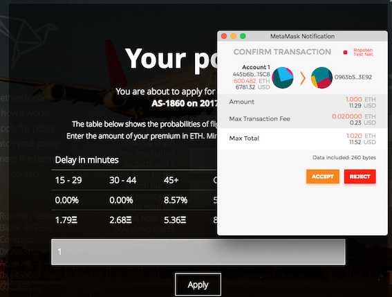

class: center, middle

# Insurance Examples - Flight Delay

---

## Cryptocoins: Blockchain to Disrupt Air Travel and Insurance with FlightDelay

- FlightDelay: https://fdd.etherisc.com/
- Github: https://github.com/etherisc/flightDelay
- Cryptocoins news article: https://www.cryptocoinsnews.com/blockchain-disrupt-air-travel-insurance-flightdelay/

---
## FlightDelay example from Cryptocoins News
- Picked a random flight and pay 0.5 ETH premium
- No delay: receive nothing
- Delay for 15 to 29 minutes (20.34%): receive 0.95 ETH


---
## FlightDelay DApp Demo - MetaMask
- MetaMask: https://metamask.io/


---
## FlightDelay DApp Demo - Mist
- Mist: https://github.com/ethereum/mist/releases


---

## FlightDelay code tracing
- Github: https://github.com/etherisc/flightDelay/blob/master/FlightDelay.sol
- Oraclize: https://github.com/oraclize/ethereum-api
    - Underwriting: flight delay probability
    - Payout: how much delay
- Flight Stats API: https://developer.flightstats.com/api-docs/

---

## FlightDelay.sol

- 使用 Oraclize 取得外部資料：事實上還是由 Oraclize 將外部資料填入智能合約當中。
- 主要兩種 API:
    - Ratings: 班機延誤評等 API。用來核保，及計算理賠金額。
    - Status: 班機起降狀態 API。用來核賠。

```JavaScript
contract FlightDelay is usingOraclize {
    ...
    string constant oraclize_RatingsBaseUrl =
        "[URL] json(https://api.flightstats.com/flex/ratings/rest/v1/json/flight/";
    ...
    string constant oraclize_StatusBaseUrl =
	  "[URL] json(https://api.flightstats.com/flex/flightstatus/rest/v2/json/flight/status/";

    ...
}
```

---

## FlightDelay.sol - 合約狀態 (1/2)
- Applied: 客戶已經支付保費，但是 oracle 還沒檢查投保班機延誤評等。
- Accepted: oracle 已檢查投保班機評等並承保該保單。
- Revoked: 客戶取消保單，費用扣除手續費後退回給客戶。
- PaidOut: 確認班機延誤並已理賠。
- Expired: 確認班機延誤時間少於 15 分鐘，不理賠。
- Declined: 核保未通過，費用扣除手續費後退回給客戶。
- SendFailed: 退費或是理賠失敗，將金額置入 RiskFund 中。


---

## FlightDelay.sol - 合約狀態 (2/2)

```Javascript
//                  00       01        02       03
enum policyState {Applied, Accepted, Revoked, PaidOut,
//					04      05           06
                  Expired, Declined, SendFailed}
```

---

## FlightDelay.solc - 保單資料結構

```Javascript
struct policy {
    // 0 - the customer
    address customer;
    // 1 - premium
    uint premium;

    // risk specific parameters:
    // 2 - pointer to the risk in the risks mapping
    bytes32 riskId;
    // 3 - probability weight. this is the central parameter
    uint weight;
    // 4 - calculated Payout
    uint calculatedPayout;
    // 5 - actual Payout
    uint actualPayout;

    // status fields:
    // 6 - the state of the policy
    policyState state;
    // 7 - time of last state change
    uint stateTime;
    // 8 - state change message/reason
    bytes32 stateMessage;
    // 9 - TLSNotary Proof
    bytes proof;
}
```

---

## FlightDelay.sol - 航班險資料結構

```Javascript
struct risk {
    // 0 - Airline Code + FlightNumber
    string carrierFlightNumber;
    // 1 - scheduled departure and arrival time in the format /dep/YYYY/MM/DD
    string departureYearMonthDay;
    // 2 - the initial arrival time
    uint arrivalTime;
    // 3 - the final delay in minutes
    uint delayInMinutes;
    // 4 - the determined delay category (0-5)
    uint8 delay;
    // 5 - counter; limit the number of identical risks.
    uint8 counter;
}
```

---

## FlightDelay.sol - 產生保單

```JavaScript
function newPolicy(
    string _carrierFlightNumber, string _departureYearMonthDay,
    uint _departureTime, uint _arrivalTime){
    ...
    bytes32 riskId = sha3(_carrierFlightNumber, _departureYearMonthDay, _arrivalTime);
    risk r = risks[riskId];
    ...
    uint policyId = policies.length++;
    policy p = policies[policyId];
    p.customer = msg.sender;
    p.premium = bookAndCalcRemainingPremium();
    p.riskId = riskId;
    ...
    r.carrierFlightNumber = _carrierFlightNumber;
    r.departureYearMonthDay = _departureYearMonthDay;
    r.arrivalTime = _arrivalTime;
    ...

    // now we have successfully applied
    p.state = policyState.Applied;
    p.stateMessage = 'Policy applied by customer';
    p.stateTime = now;

    // call oraclize to get Flight Stats; this will also call underwrite()
    getFlightStats(policyId, _carrierFlightNumber);
}
```

---

## FlightDelay.sol - 取得航班評等資料

```Javascript
function getFlightStats( uint _policyId, string _carrierFlightNumber) {

    // call oraclize and retrieve the number of observations from flightstats API
    // format https://api.flightstats.com/flex/ratings/rest/v1/json/flight/OS/75?appId=**&appKey=**

    string memory oraclize_url = strConcat(
        oraclize_RatingsBaseUrl,
        _carrierFlightNumber,
        oraclizeRatingsQuery
        );

    bytes32 queryId = oraclize_query("nested", oraclize_url, oraclizeGas);
    // calculate the spent gas
    bookkeeping(acc_OraclizeCosts, acc_Balance, uint((-ledger[acc_Balance]) - int(this.balance)));
    oraclizeCallbacks[queryId] = oraclizeCallback(_policyId, oraclizeState.ForUnderwriting, 0);
}
```

---

## FlightDelay.sol - 等待 Oraclize 回應以後決定承保或是拒保

``` Javascript
function callback_ForUnderwriting(uint _policyId, string _result, bytes _proof)
    onlyInState(_policyId, policyState.Applied)
    internal {

    var sl_result = _result.toSlice();
    ...
    if (observations <= minObservations) {
        decline(_policyId, 'Declined (too few observations)', _proof);
    } else {
        uint[6] memory statistics;
        // calculate statistics (scaled by 100)
        statistics[0] = observations;
        ...
        // underwrite policy
        underwrite(_policyId, statistics, _proof);
    }
}
```

---

## FlightDelay.sol - 承保，並排程 Oraclize 取得該航班狀態

``` Javascript
function underwrite(uint _policyId, uint[6] _statistics, bytes _proof) internal {
    policy p = policies[_policyId]; // throws if _policyId invalid
    for (uint8 i = 1; i <= 5; i++ ) {
        p.weight += weightPattern[i] * _statistics[i];
        // 1% = 100 / 100% = 10,000
    }
    // to avoid div0 in the payout section, we have to make a minimal assumption on p.weight.
    if (p.weight == 0) { p.weight = 100000 / _statistics[0]; }
    p.proof = _proof;
    risk r = risks[p.riskId];

    // schedule payout Oracle
    schedulePayoutOraclizeCall(
        _policyId,
        r.carrierFlightNumber,
        r.departureYearMonthDay,
        r.arrivalTime + 15 minutes
    );

    p.state = policyState.Accepted;
    p.stateMessage = 'Policy underwritten by oracle';
    p.stateTime = now;
}
```

---

## FlightDelay.sol - 排程 Oraclize 取得該航班狀態

```JavaScript
function schedulePayoutOraclizeCall(
    uint _policyId,
    string _carrierFlightNumber,
    string _departureYearMonthDay,
    uint _oraclizeTime)
    internal {

    string memory oraclize_url = strConcat(
        oraclize_StatusBaseUrl,
        _carrierFlightNumber,
        _departureYearMonthDay,
        oraclizeStatusQuery
        );

    bytes32 queryId = oraclize_query(_oraclizeTime, 'nested', oraclize_url, oraclizeGas);
    bookkeeping(acc_OraclizeCosts, acc_Balance, uint((-ledger[acc_Balance]) - int(this.balance)));
    oraclizeCallbacks[queryId] = oraclizeCallback(_policyId, oraclizeState.ForPayout, _oraclizeTime);
}
```

---

## FlightDelay.sol - 取得 Oraclize 回應並決定是否理賠 (1/2)

```Javascript
function callback_ForPayout(bytes32 _queryId, string _result, bytes _proof) internal {
    oraclizeCallback memory o = oraclizeCallbacks[_queryId];
    uint policyId = o.policyId;
    var sl_result = _result.toSlice();
    ...
    bytes1 status = bytes(sl_result.toString())[0];	// s = L

    // 取消或是改航線
    if (status == 'C') {
        // flight cancelled --> payout
        payOut(policyId, 4, 0);
        return;
    } else if (status == 'D') {
        // flight diverted --> payout
        payOut(policyId, 5, 0);
        return;
    } else if (status != 'L' && status != 'A' && status != 'C' && status != 'D') {
        LOG_PolicyManualPayout(policyId, 'Unprocessable status');
        return;
    }
    ...
}
```

---

## FlightDelay.sol - 取得 Oraclize 回應並決定是否理賠 (2/2)

```Javascript
function callback_ForPayout(bytes32 _queryId, string _result, bytes _proof) internal {
    ...
    sl_result = _result.toSlice();
    bool arrived = sl_result.contains('actualGateArrival'.toSlice());
    if (status == 'A' || (status == 'L' && !arrived)) {
        // flight still active or not at gate --> reschedule
        ...
        schedulePayoutOraclizeCall(policyId, r.carrierFlightNumber, r.departureYearMonthDay, o.oraclizeTime + 45 minutes);
    } else if (status == 'L' && arrived) {
        uint delayInMinutes = ...
        if (delayInMinutes < 15) {
            payOut(policyId, 0, 0);
        } else if (delayInMinutes < 30) {
            payOut(policyId, 1, delayInMinutes);
        } else if (delayInMinutes < 45) {
            payOut(policyId, 2, delayInMinutes);
        } else {
            payOut(policyId, 3, delayInMinutes);
        }
    } else { // no delay info
        payOut(policyId, 0, 0);
    }
}
```
